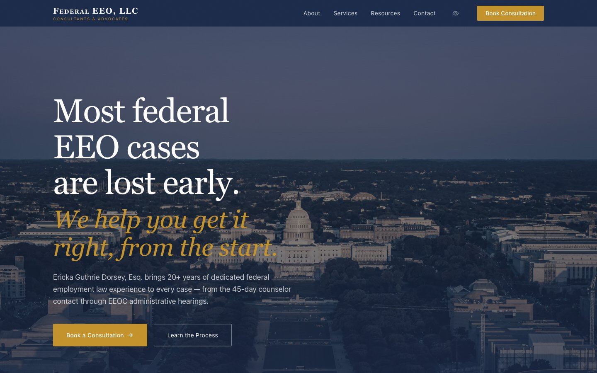

# Federal EEO, LLC — Official Website

> Most federal EEO cases are lost early — we help you get it right, from the start.

[](https://github.com/Kirans0615/Federal-EEO-Web/actions/workflows/deploy-pages.yml)
[](https://github.com/Kirans0615/Federal-EEO-Web/actions/workflows/ci.yml)



---

## View the Site

| Deployment | URL | Purpose |
|---|---|---|
| **Production (Vercel)** | [federal-eeo.com](https://federal-eeo.com) | Live site — full server features, real form submissions |
| **Static Preview (GitHub Pages)** | [kirans0615.github.io/Federal-EEO-Web](https://kirans0615.github.io/Federal-EEO-Web/) | Permanent mirror — free hosting, stakeholder preview |

---

## Overview

This is the official marketing and intake website for **Federal EEO, LLC**, a Washington, DC-based federal employment law practice led by **Ericka Guthrie Dorsey, Esq.**

The site is built as a full Next.js application and is deployed to two targets:

- **Vercel (production):** serves the site as a full server-side Next.js app with active API routes, Resend transactional email, Vercel Postgres lead capture, and a Cal.com scheduling embed.
- **GitHub Pages (static mirror):** serves a fully static export of the same codebase, compiled at push time. Server-only features (form submission, email sending, database writes) are gracefully degraded with a message directing users to the live site.

---

## Tech Stack

| Layer | Technology |
|---|---|
| Framework | [Next.js 14](https://nextjs.org) — App Router, TypeScript strict mode |
| Styling | [Tailwind CSS](https://tailwindcss.com) + [shadcn/ui](https://ui.shadcn.com) |
| Animations | [Framer Motion](https://www.framer.com/motion/) |
| Forms | [React Hook Form](https://react-hook-form.com) + [Zod](https://zod.dev) |
| Email | [Resend](https://resend.com) — transactional email with HTML templates |
| Scheduling | [Cal.com](https://cal.com) — embeddable scheduling |
| Database | [Vercel Postgres](https://vercel.com/storage/postgres) — lead capture |
| Analytics | [Vercel Analytics](https://vercel.com/analytics) |
| Hosting | [Vercel](https://vercel.com) (production) + [GitHub Pages](https://pages.github.com) (mirror) |

---

## Local Development

```bash
# Install dependencies
npm install

# Start the development server
npm run dev
```

Open [http://localhost:3000](http://localhost:3000). The site hot-reloads as you edit files.

**Required environment variables** — create `.env.local` at the project root:

```bash
RESEND_API_KEY=re_xxxxxxxxxxxx
POSTGRES_URL=postgresql://...
CAL_SCHEDULING_LINK=https://cal.com/federal-eeo
```

See `SETUP.md` for complete setup instructions (Resend DNS, Vercel Postgres, Cal.com).

---

## Deployment

### Vercel (Production)

The Vercel deployment runs the full Next.js server. All features are active:

- `POST /api/intake` — writes leads to Postgres, sends dual Resend emails, redirects to Cal.com
- `next/image` optimization (AVIF + WebP, CDN-served)
- Server-side rendering

To deploy: import this repository into Vercel and set the environment variables listed in `SETUP.md §5`.

### GitHub Pages (Static Mirror)

Every push to `main` triggers the GitHub Actions workflow at `.github/workflows/deploy-pages.yml`, which:

1. Runs `GITHUB_PAGES=1 npm run build` to produce a static export in `./out/`
2. Uploads `./out/` as the Pages artifact
3. Deploys to `github-pages` environment

The static build sets `basePath: /Federal-EEO-Web`, `assetPrefix: /Federal-EEO-Web`, `trailingSlash: true`, and `images.unoptimized: true` for GitHub Pages compatibility.

**Enable GitHub Pages manually** (one-time setup, cannot be automated):

> Repository Settings → Code and automation → Pages → Build and deployment → Source: **GitHub Actions**

---

## Custom Domain (Future Step)

The `CNAME` file in this repository contains `federal-eeo.com`. **Do not enable this CNAME until either:**

- The production stack is fully migrated to GitHub Pages, **or**
- The `federal-eeo.com` domain is intentionally pointed at the static mirror

Activating the CNAME now would break Resend email delivery, Vercel Postgres lead capture, and the Cal.com embed, all of which require the Vercel server. Custom domains for GitHub Pages must also be configured through repository settings or the GitHub REST API — committing a `CNAME` file alone is not sufficient.

---

## Brand Assets

Four SVG logo concepts are in [`/public/logos/`](public/logos/):

| File | Style |
|---|---|
| `logo-concept-1.svg` | Serif wordmark with gold rule |
| `logo-concept-2.svg` | Monogram seal — navy circle, gold initials |
| `logo-concept-3.svg` | Balance-scale icon + logotype |
| `logo-concept-4.svg` | All-caps condensed with gold accent bar |

Brand palette: Navy `#1B2A4A` · Gold `#C4922A` · Cream `#F4EFE6`

---

## Pages

| Route | Description |
|---|---|
| `/` | Homepage — hero, credentials marquee, services overview, mission reveal, testimonials, FAQ |
| `/about` | Ericka Guthrie Dorsey — biography, credentials timeline, practice areas |
| `/services` | Service tiers, pricing (TBD — see `CONTENT.md`), FAQs |
| `/resources` | EEO deadline timeline, downloadable guides (coming soon) |
| `/contact` | Multi-step intake form → Postgres + Resend + Cal.com |
| `/book` | Cal.com scheduling embed |
| `/brand` | Internal brand reference — logo concepts, palette, typography |
| `/privacy` | Privacy policy |
| `/terms` | Terms of service |

---

## Pre-Launch Checklist

All outstanding content items are tracked in [`CONTENT.md`](CONTENT.md). Critical blockers before going live:

- [ ] Set all service prices (currently `TBD`)
- [ ] Add phone number and physical DC office address
- [ ] Replace placeholder testimonials (require signed client releases)
- [ ] Confirm Ericka's headshot and all photography usage rights
- [ ] Complete Cal.com setup (see `SETUP.md §4`)
- [ ] Verify Resend domain DNS (see `SETUP.md §2`)

---

## Contact

**Ericka Guthrie Dorsey, Esq.**  
Federal EEO, LLC · Washington, DC  
[edorsey@federal-eeo.com](mailto:edorsey@federal-eeo.com) · [(301) 531-4322](tel:+13015314322)

**Disclaimer:** The information on this website is for general informational purposes only and does not constitute legal advice. Viewing this site or submitting the intake form does not create an attorney-client relationship or guarantee representation.

---

## Credits

Designed and developed by **Kiran Sen**, The George Washington University.
